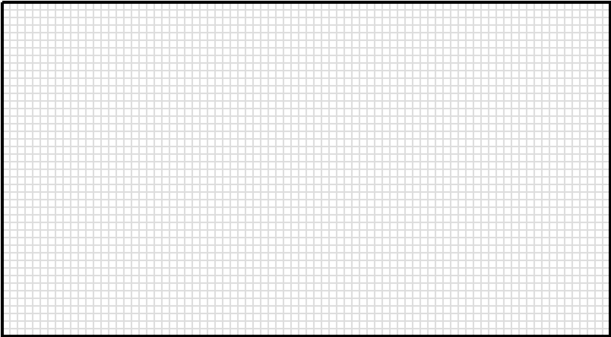
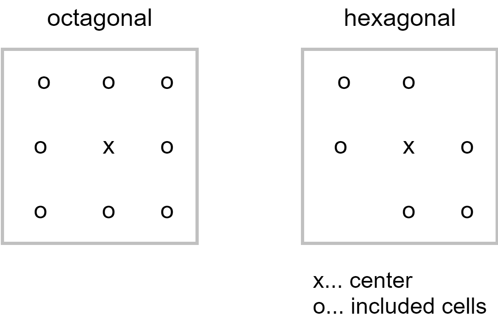
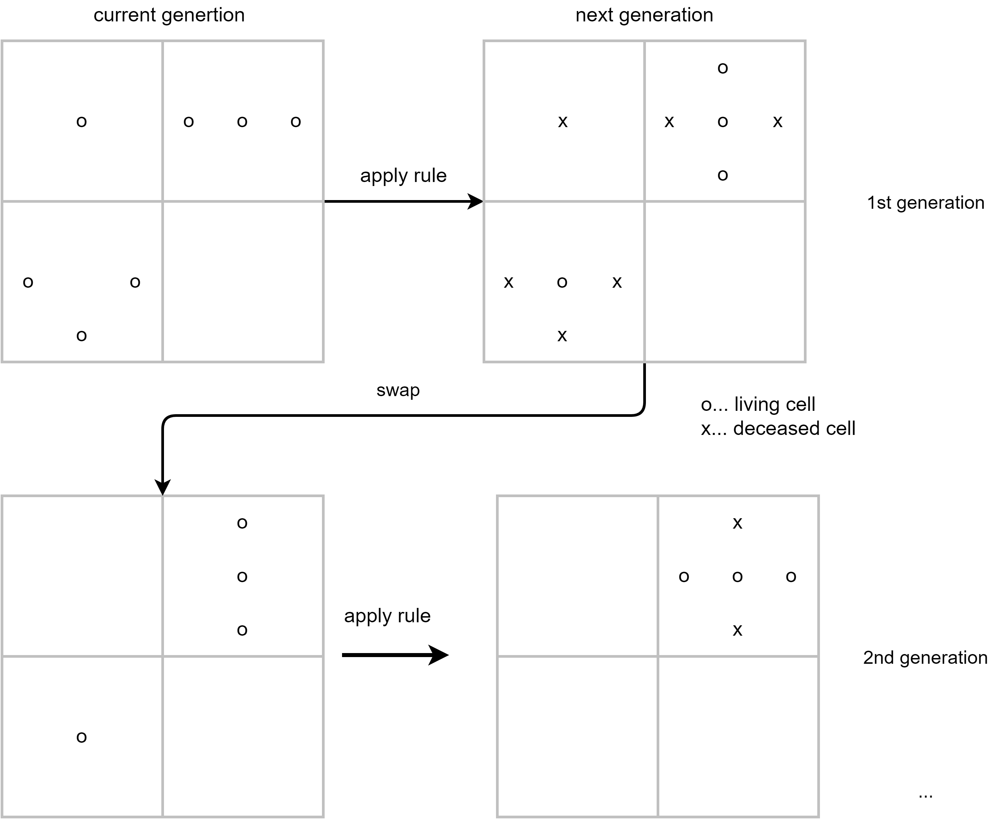
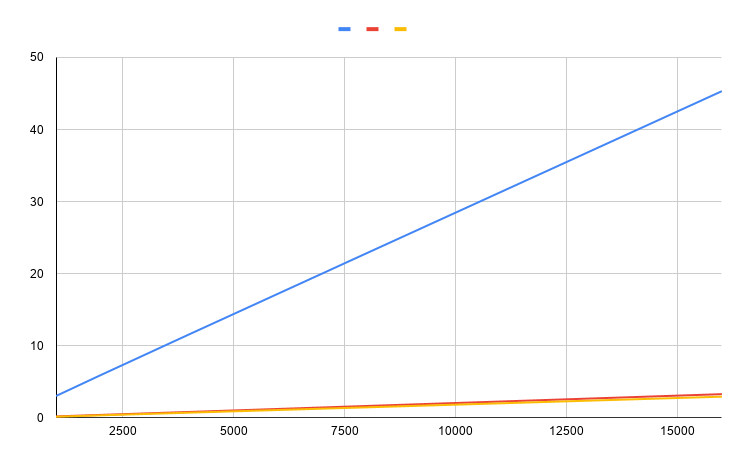

# Hexagonal_Cellular_Automata
Conways game of life hexagonal

make run

Nur die inneren Felder werden berechnet, die erste und letzte Zeile/Spalte wird als ‘dead’
angenommen und nicht upgedatet. Der Vorteil ist dass man keine range checks durchführen muss.

Octagonal und hexagonal unterscheiden sich in der Anzahl der miteinberechneten 
Nachbarzellen.

classic game of life rules
•“ Birth” happens in the Survivescentre if there are three neighbours.
• The centre cell “” if there are two or three neighbours
• Otherwise, all the exceptios result in death.

|           |   1000  |  2000  |  4000  |  8000   |  16000  | gen
|sequential |   3.05  |  5.93  |  11.6  |  22.86  |  45.33  |  s
|openmp	    |   0.22  |  0.43  |  0.84  |   1.67  |   3.31  |  s
|openCl     |   0.18  |  0.37  |  0.74  |   1.48  |   2.96  |  s
